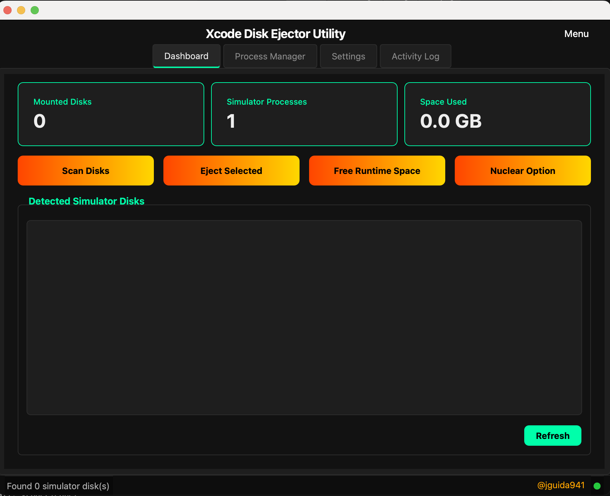

# XcodeCleaner

PyQt6 macOS utility to manage Xcode Simulator mounts and reclaim disk space.

## Requirements

- macOS 12+ (Monterey or later)
- Python 3.10+
- Xcode Command Line Tools (`xcode-select --install`)

## Screenshot



## Why this exists

Xcode/iOS Simulator can mount disk images (runtimes / Cryptex) that:
- Show up in Finder and Disk Utility
- Reappear after manual eject
- Consume significant disk space (often tens of GB)
- And its annoying as F***

## Important mental model: eject ≠ free space

**Ejecting a simulator disk only unmounts it.**  
The disk space is still consumed by the backing files until you delete them.

### Where the “real” space lives

- **System runtime backing files (largest)**
  - `/Library/Developer/CoreSimulator/Volumes/`
  - `/Library/Developer/CoreSimulator/Cryptex/`
- **User-space simulator data**
  - `~/Library/Developer/CoreSimulator/Devices/`
  - `~/Library/Developer/Xcode/DerivedData/`

## What the app does

- **Scan Disks**: find simulator-related mounted slices and display them
- **Eject Selected**: unmount selected simulator volumes (does *not* free disk space by itself)
- **Free Runtime Space**: performs a safe cleanup that actually reclaims space:
  - `xcrun simctl shutdown all`
  - `xcrun simctl delete unavailable`
  - deletes user-space simulator devices + DerivedData
  - optionally deletes `/Library/Developer/CoreSimulator/Volumes/iOS_*` and `/Library/Developer/CoreSimulator/Cryptex` (**requires admin**)
- **Nuclear Option**: aggressive cleanup (kills processes, deletes sim devices, clears caches)

## Verify reclaimed space

Run (before and after cleanup):

```bash
df -h /System/Volumes/Data
```

## Run it

### Option A: Launcher (recommended)

Creates a local venv, installs dependencies, installs the package editable, then launches the GUI:

```bash
python scripts/launch_xcodecleaner.py
```

### Option B: Manual

```bash
python -m venv .venv
source .venv/bin/activate
pip install -r requirements.txt
pip install -e .
python -m xcodecleaner
```

## CLI Usage

```bash
# Launch GUI (default)
python -m xcodecleaner

# Run full cleanup headless (no GUI)
python -m xcodecleaner --nuclear
```

## Development

```bash
pip install -r requirements-dev.txt
pytest -v
```

### Running Tests

```bash
# Run all tests
pytest tests/ -v

# Run only CLI tests
pytest tests/test_cli.py -v

# Run only core service tests
pytest tests/test_core.py -v
```

## Known Limitations

- **SIP (System Integrity Protection)**: Some runtime files may require SIP modifications to fully delete. The app uses `xcrun simctl runtime delete` which works with SIP enabled.
- Requires Xcode Command Line Tools for `simctl` commands.
- Simulators will be re-created if you open Xcode or run iOS builds.

## Safety notes

- Deleting `/Library/Developer/CoreSimulator/...` requires admin and can remove installed simulator runtimes.
- If you're not sure, run **Free Runtime Space** and answer **No** to the system-runtime prompt to keep cleanup user-space only.

## License

MIT
